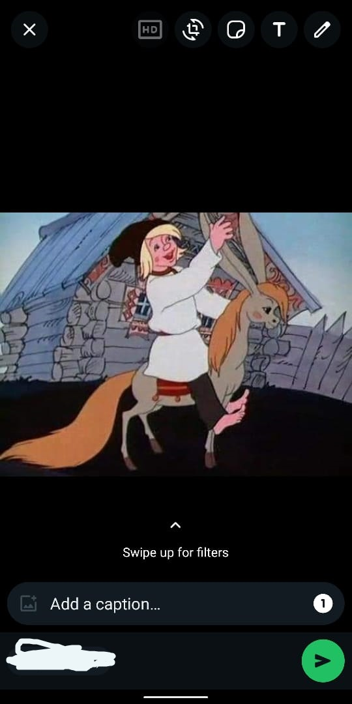
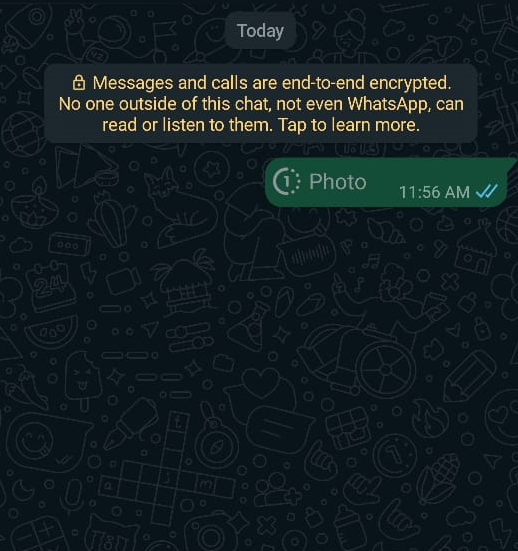
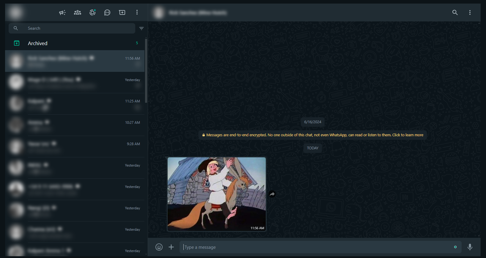

# WhatsApp View Once Bypass


WhatsApp View Once Bypass is a Chrome extension that enhances WhatsApp Web functionality by allowing users to view and save photos indefinitely, bypassing the app's view once feature.

## Important Update
Due to a recent security update released by WhatsApp in OCT 2024, the current version of the extension is no longer fully functional. The update has affected the extension’s ability to bypass the view once feature. I am actively working on an updated version that will restore the full functionality.

Please stay tuned for further updates, and thank you for your patience and understanding.

## Features

- **Override View Once**: View and save photos marked for view once multiple times.
- **Download Media**: Download media files even if they are set to disappear after a single view.
- **IndexedDB Integration**: Utilizes IndexedDB to manage message statuses and preferences.

## Installation

1. **Clone the repository:**
   ```bash
   git clone https://github.com/tharinduxd/whatsapp-view-once-bypass-chrome-extension.git
   ```

2. **Load the extension in Chrome:**
   - Open Google Chrome and go to `chrome://extensions/`.
   - Enable Developer mode (toggle switch usually located in the top right corner).
   - Click on "Load unpacked" and select the cloned `whatsapp-view-once-bypass-chrome-extension` directory.

## Usage

Open WhatsApp Web in your Google Chrome browser. Photos marked for view once will now be viewable multiple times and can be downloaded.

## Contributing

Contributions are welcome! If you'd like to contribute to WhatsApp View Once Bypass, please follow these steps:

1. Fork the repository and create your branch (`git checkout -b feature/AmazingFeature`).
2. Commit your changes (`git commit -am 'Add some AmazingFeature'`).
3. Push to the branch (`git push origin feature/AmazingFeature`).
4. Open a pull request.

## Acknowledgements

Special thanks to contributors and open-source libraries used in this project.

## Sample Output

Here are some examples of the output generated by my extension:

<div align="center">
  <table>
    <tr>
      <td align="center">
        <br>
        <sub>Sample Output 1: Viewing on the phone </sub>
      </td>
      <td align="center">
        <br>
        <sub>Sample Output 2: phone view</sub>
      </td>
      <td align="center">
        <br>
        <sub>Sample Output 3: Viewing on the web</sub>
      </td>
    </tr>
  </table>
</div>


